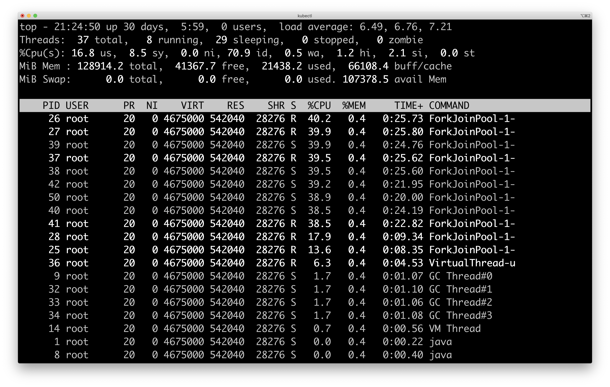

Sling & Loom
============

This project runs an [Apache Sling](https://sling.apache.org) instance powered by [Jetty](https://www.eclipse.org/jetty) configured with an unbounded virtual threads pool. Virtual threads require an [early-access builds](https://jdk.java.net/loom) of the OpenJDK project [Loom](https://openjdk.java.net/projects/loom).

# Setup

Setup Project Loom early-access build by following the [instructions](https://jdk.java.net/loom/). Once setup, your java version should look like the following.

```
$ java -version
openjdk version "16-loom" 2021-03-16
OpenJDK Runtime Environment (build 16-loom+4-56)
OpenJDK 64-Bit Server VM (build 16-loom+4-56, mixed mode, sharing)
```

# Run

Make sure that Apache Maven is available on your setup and if needed [install Apache Maven](https://maven.apache.org/install.html). Clone this project on your local file system, then run the following command

```bash
mvn clean install
```

The [slingstart-maven-plugin](https://sling.apache.org/components/slingstart-maven-plugin/repository-mojo.html) will take care of starting an `author` Sling instance on port `9090`. The instance is configured with an unbounded pool of virtual threads.

Have a look at the [provisioning model files](src/main/provisioning) to see what OSGi bundles and configurations are used. The virtual thread pool support is added via a custom build of the Apache Felix org.apache.felix.http.jetty [project](https://github.com/tmaret/felix-dev/tree/unbounded-virtual-thread-pool).

# Play

Once your Sling instance is running, you should be able to access it on http://localhost:9090 and play with it.

## Request the default page


```bash
curl -u admin:admin http://localhost:9090/index.html
```

## Micro benchmark

```bash
ab -A admin:admin -c 50 -n 10000 http://localhost:9090/index.html
```

## Monitor threads

Using `top` monitor the resources used by the server while serving the micro benchmark above. Note how few kernel threads are used to serve at high concurrency level.


